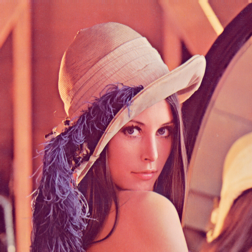
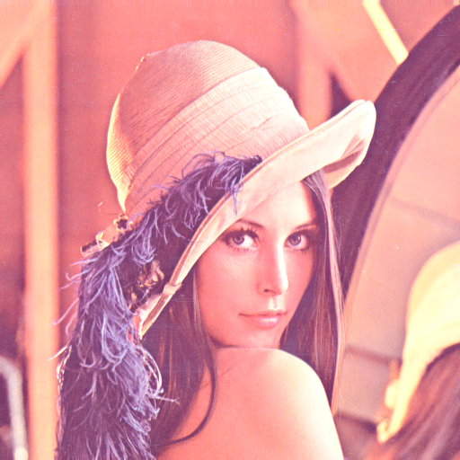
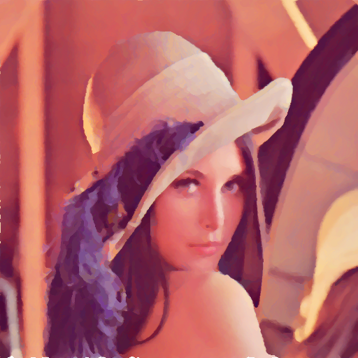
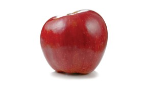
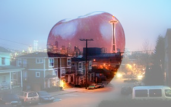
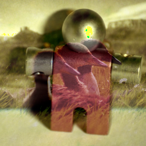
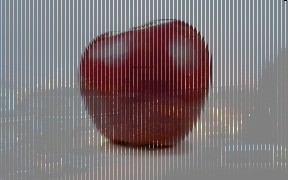
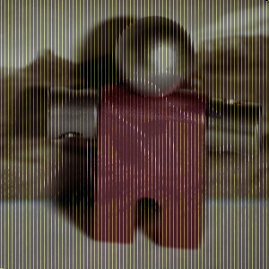

# TP 2 SMID Argel Zarza Luna


1.**[Aclarar](https://github.com/erik-argel/TP_II_Orga_II_SIMD/tree/main#aclarar)** 

2.**[Median Filter](https://github.com/erik-argel/TP_II_Orga_II_SIMD/tree/main#median-filter)**

3.**[Blend Modes C](https://github.com/erik-argel/TP_II_Orga_II_SIMD/tree/main#blend-modes-c-)**

4.**[Blend Modes ASM](https://github.com/erik-argel/TP_II_Orga_II_SIMD/tree/main#blend-modes-asm-)**

5.**[Comparativa](https://github.com/erik-argel/TP_II_Orga_II_SIMD/tree/main#comparativa)**


En este trabajo generaremos diversas funciones que procesaran las imágenes, para eso utilizaremos, un menú, que se ejecutara

    sh Supermenus.sh
   
   En el que podrá ejecutar todas las operaciones del enunciado del trabajo practico. 

   ```sh
        a.  Ver contenido de carpeta
        b.  Convertir a Blanco Y Negro
        c.  Editar interfaceBlancoYNegro
        d.  Compilar interfaceBlancoYNegro
        e.  Aclarar Imagen
        f.  Editar interfaceAclarar
        g.  Compilar interfaceAclarar
        h.  Corromper Imagen
        i.  Editar interfaceCorromper
        j.  Compilar interfaceCorromper
        k.  MedianFilter
        l.  Editar interfaceMedianFilter
        m.  Compilar interfaceMedianFilter
        n.  MultiplyBlend
        o.  Editar interfaceMultiplyBlend
        p.  Compilar interfaceMultiplyBlend
        r.  Abrir estados de procesos
        s.  Buscar en carpeta
        t.  Ver estado del proyecto
        w.  Guardar cambios
        x.  Actualizar repo
        q.  Salir

   ```


## Aclarar

Para poder aclarar la imagen  nosotros poseemos dos funciones:

    aclararimagen(BMPDATA *bmpData, int  nivel)
  Que esta recibe la imagen , y el nivel de aclaramiento de la imagen, esta comienza  a recorrer la matriz que nos brinda *bmpData, y luego llamamos a la función  **aclarar** que le pasamos el arreglo del bmp descompuesto en el rgb , que luego  vamos sumando cada pixel y al mismo tiempo chequeando que el color no supere los 255 para contener bien el contraste.
  

    void  aclarar(unsigned  char* red, unsigned  char* green, unsigned  char* blue, int  n)

Para poder realizar las operaciones deberemos realizar los siguientes comandos:

```sh
        Opción e. Aclarar Imagen
    --------------------------------------

        Escriba el nombre de la imagen:lena.bmp
        Escriba la en nivel de aclarado que quiere agregar:50
        Organización del Computador 2.
        Trabajo Práctico Nro. 2
        Programa para procesamiento de imágenes BMP.
        Funcion: 2 
        NombreImagen: lena.bmp 
        Nivel: 50 
        Tamaño ventana: -143213548 

        Tiempo de proceso: 6519 ticks.

        ./tp 2 lena.bmp 50


   ```


  


 
## Median Filter

Para poder ejecutar la mediana de una imagen contaremos con dos procesos, el primero sera corromper la imagen en el cual utilizamos la función:


    void corremper(BMPDATA *bmpData)  


Para esto le brindaremos una imagen para poder corromperla


Luego ejecutaremos el comando, que recorrera toda la imagen generando espacios en blanco para luego poder ser corregida, mediante el median filter.


```sh
        Opción h. Corromper Imagen
        --------------------------------------

        Escriba el nombre de la imagen:lena.bmp
        Organización del Computador 2.
        Trabajo Práctico Nro. 2
        Programa para procesamiento de imágenes BMP.
        Funcion: 3 
        NombreImagen: lena.bmp 
        Nivel: -1 
        Tamaño ventana: -142816236 

        Tiempo de proceso: 16438 ticks.


   ```
 
 Apartir del proceso de corromper la imagen la imagen sera remplazada por la siguienta:


Luego de eso nosotros creamos dos arreglos para guardar los valores de la ventana, uno con la suma los valores RGB de cada pixel y otro con el indice de cada pixel en la imagen revisamos que los valores no se excedan del limite no se extiende la imagen cuando se llega al borde, solo se achica la ventanta estos indices se usan para recorrer la ventana del pixel actual, despues se llenan los pixeles correspondientes a la ventana, luego se orden ambos arreglos y reemplazo el pixel por el valor de la mediana.

    void  medianfilter(BMPDATA *bmpData, int  ventana)


    void  mfilterPixel (int  pixel, BMPDATA *bmpData, int  ventana, int  x, int  y)


```sh
        Opción k. MedianFilter
        --------------------------------------

        Escriba el nombre de la imagen:lena.bmp
        Escriba el tamaño de la ventana que quiere usar:2
        Organización del Computador 2.
        Trabajo Práctico Nro. 2
        Programa para procesamiento de imágenes BMP.
        Funcion: 4 
        NombreImagen: lena.bmp 
        Nivel: -1 
        Tamaño ventana: 2 

        Tiempo de proceso: 336482 ticks.
```



 

## Blend Modes ( c )

Para poder realizar el proceso de blending nosotros usaremos el estilo Dodge blend, que a diferencia del blending normal, dividimos la capa inferior por la capa superior invertida. Esto aclara la capa inferior en función del valor de la capa superior: cuanto más brillante es la capa superior, más afecta su color a la capa inferior. 





```sh
        Opción n. MultiplyBlend
        --------------------------------------

        Escriba el nombre de la primera imagen:apple.bmp
        Escriba el nombre de la segunda imagen:city.bmp
        Organización del Computador 2.
        Trabajo Práctico Nro. 2
        Programa para procesamiento de imágenes BMP.
        Funcion: 5 
        NombreImagen: apple.bmp 
        Nivel: -1 
        Tamaño ventana: -143492076 
        NombreImagen: city.bmp 
        Tiempo de proceso: 2272 ticks.

```


Como resultado nos da la siguiente imagen




Luego probaremos una imagen de distintas proporciones:


```sh

        --------------------------------------
        Opción n. MultiplyBlend
        --------------------------------------

        Escriba el nombre de la primera imagen:patos.bmp
        Escriba el nombre de la segunda imagen:robot.bmp
        Organización del Computador 2.
        Trabajo Práctico Nro. 2
        Programa para procesamiento de imágenes BMP.
        Funcion: 5 
        NombreImagen: patos.bmp 
        Nivel: -1 
        Tamaño ventana: -143000556 
        NombreImagen: robot.bmp 
        Tiempo de proceso: 3884 ticks.

```
Como resultado nos da la siguiente imagen




## Blend Modes ( asm )

En cuanto  al procesamiento de las imagenes en assembler para lograr el multiple blending utilizamos el modelo simple, para que sea mas simple la realizacion del mismo.
Para lograr esto en el metodoo asm_blend(), recibimos  como parametros dos arreglos, uno para cada imagen, y un int que indica el tamaño total de estos. Se ejecuta 3 veces, una para cada arreglo de colores. Cuando se lo llama agarra los punteros de ambos arreglos y los recorre en base  a su tamaño.

```C
    void blendBmpAsm (BMPDATA *bmpData1, BMPDATA *bmpData2)
```

En cada itereación se guardan 4 valores de ambos arreglos en dos registros xmm, el registro se divide en 4 de 32bits y se guarda un valor en cada parte. Luego se cambian estos de int a punto flotante de presición doble. Una vez así, se dividen ambos registros por 2 y luego se suman entre si. Luego de esto se vuelven a guardar en memoira. El ciclo se ejecuta cada 4 valores de los arreglos, aprovechando asi SSE.


Y como resultado nos da la siguiente



Luego probamos con otras dimensiones 


Y como resultado nos da la siguiente



## Comparativa


|  |Tiempo  |Tamaño|Medidas|
|--|--|--|--|
|C  Ejemplo1| 3884 |264.35 KiB |300x300|
|ASM Ejemplo1|1875|264.35 KiB |300x300|
|C  Ejemplo2| 2272 |152.01 KiB |288x180|
|ASM Ejemplo2|1011 |152.01 KiB |288x180|


 
